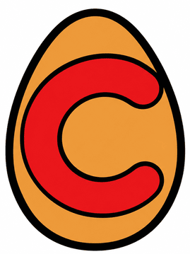

<h1> egg-c: egraph-good with C++</h1>

A personal C++20 implementation of [egg (egraph-good)](https://github.com/egraphs-good/egg),
an e-graph library for equality saturation.

An independent project, unaffiliated with the official egg project.

## Quick start

Use the supplied `SymbolLang` to get started, or provide a custom node type and
analysis for your application.

```cpp
#include <eggc/all.hpp>
#include <iostream>
#include <vector>

int main() {
    using eggc::rewrite;
    auto input = eggc::parse_expr("(+ 0 (* 1 a))"); // 0 + (1 * a)
    std::vector rules{
        rewrite("commute-add", "(+ ?x ?y)", "(+ ?y ?x)"),
        rewrite("add-zero", "(+ ?x 0)", "?x"),
        rewrite("mul-one", "(* 1 ?x)", "?x"),
    };

    eggc::EGraph<eggc::SymbolLang> graph;
    auto root = graph.add_expr(input);
    // The rules establish: 0 + (1 * a) = 0 + a = a + 0 = a.
    auto report = eggc::run(graph, rules);
    if (report.reason != eggc::StopReason::Saturated) return 1;

    // Choose the expression with the fewest AST nodes: a, with cost 1.
    auto [cost, best] = eggc::Extractor<eggc::SymbolLang>(graph).find_best(root);
    std::cout << eggc::to_string(best) << '\n'; // Expected output: a
}
```

`SymbolLang` stores symbols, including `0` and `1`; it does not perform arithmetic
by itself. Rewrite rules supply equations. Custom languages can store typed
values and attributes, with optional parsing through `LanguageIO<L>`.
Conditional rules use `Condition<L, A>` to inspect matches and analysis facts.

## Build and run

```sh
cmake -S . -B build -DCMAKE_BUILD_TYPE=Release
cmake --build build
ctest --test-dir build --output-on-failure
./build/examples/tutorial_getting_started
```

Or use Bazel:

```sh
bazel test //tests:all //examples:all
bazel run //examples:tutorial_getting_started
```

Examples build by default; use `-DEGGC_BUILD_EXAMPLES=OFF` to omit them. CMake
consumers link the `eggc` interface target, which supplies the include path and
C++20 requirement. External Bazel consumers must enable C++20 in their workspace.
There is no compiled library to link.

## Learn

Follow the tutorials in order:

1. [Getting started](docs/01_getting_started.md): build a small optimizer with rewrite rules.
2. [Expressions and matching](docs/02_expression_and_matching.md): match patterns and merge equivalent expressions.
3. [Conditional rewrites](docs/03_conditional_rewrites.md): decide when a rewrite is allowed.
4. [Custom languages](docs/04_custom_langage.md): define a node type for search filters.

See [docs](docs/) for reference guides and [examples](examples/) for runnable code.

## Layout

```text
include/eggc/   Public API headers
  impl/        Included template implementations and text syntax helpers
examples/      Runnable examples
tests/         Engine and API regression tests
docs/          Short guides
misc/images/   Artwork
```

Use `eggc/all.hpp` for the complete library, `eggc/core.hpp` for the generic
engine, or `eggc/text.hpp` for symbols and text-based rules. Individual public
headers also work. Template definitions live in `impl/` and are included
automatically; ship that directory with the headers. The library remains
header-only, with no `src/` directory.

Use `eggc/engine.hpp` for the minimal generic engine; `core.hpp` and `all.hpp`
remain compatibility umbrellas. The [reusable runner example](examples/reusable_runner.cpp)
shows compiled rule reuse, execution slices, scoped extraction, and rewrite replay.
